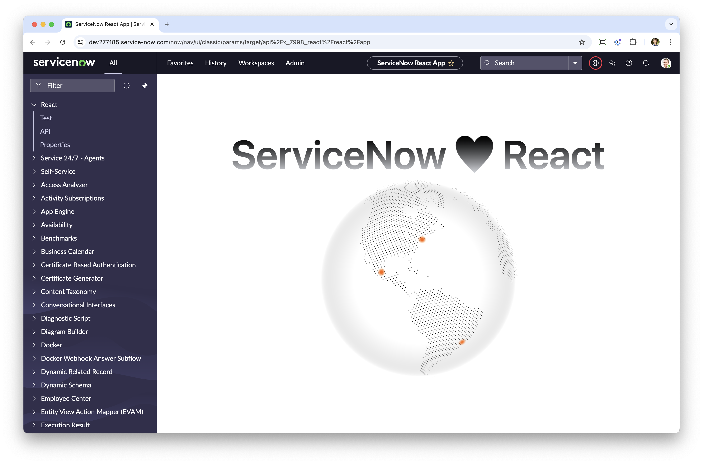
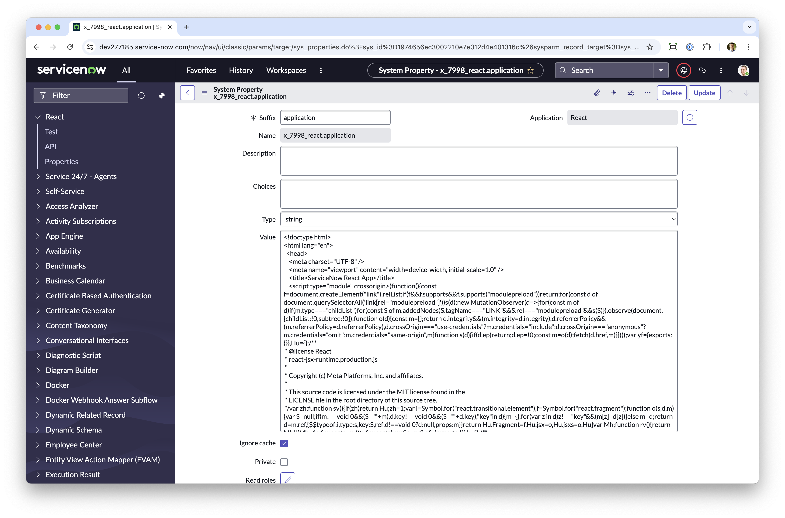
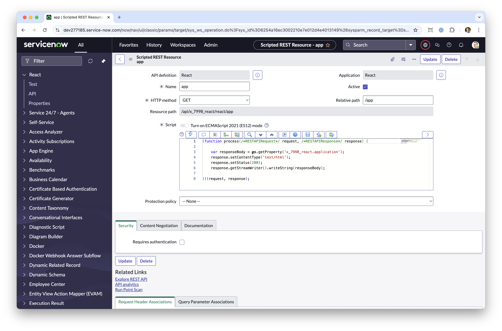
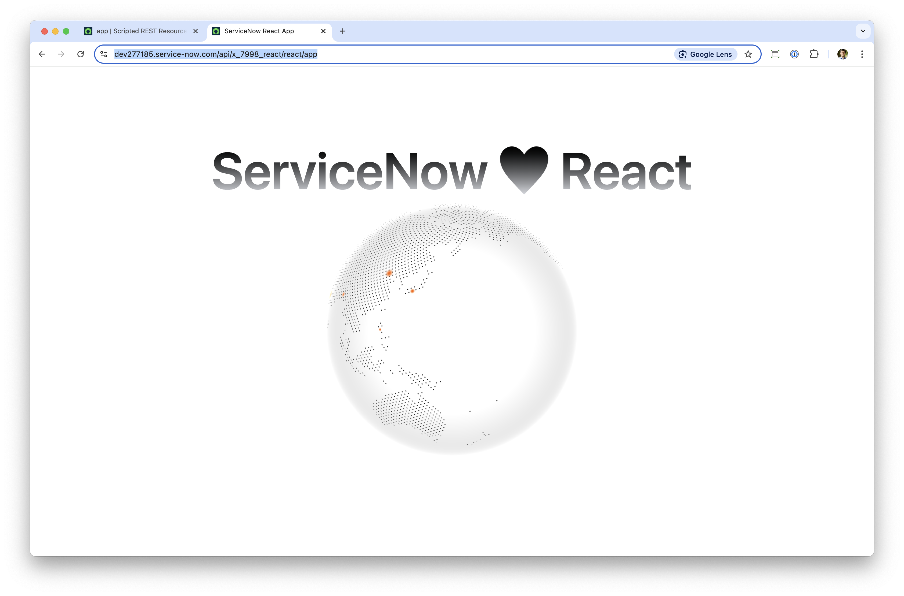

# ServiceNow React App Boilerplate

This is a boilerplate for a ServiceNow React app. It is a minimalistic app to get you started with building advanced UI/UX interfaces in React that can be hosted in ServiceNow.



### Features
- React
- TypeScript
- Tailwind CSS
- Pre-configured for ServiceNow


## 1. Build the application

Clone the repository and install the dependencies:
```bash
npm install
```
You can now run the application locally using:
```bash
npm run dev
```
Use the existing code as a starting point to build your own application - add any additional libraries and components you need.


## 2. Compile the application

To compile the application, run:
```bash
npm run build
```
This will create a `dist` folder with the compiled application as a single HTML file.

## 3. Host and run the application in ServiceNow

The way how to host the application in ServiceNow is very simple and straightforward:

1. Create a system property with string type and copy the content of the `dist/index.html` file into the value field of the system property.
   
2. Create a Scripted REST API `GET` endpoint with the following script:
```js
(function process(/*RESTAPIRequest*/ request, /*RESTAPIResponse*/ response) {

	var responseBody = gs.getProperty('YOUR_SYSTEM_PROPERTY_NAME');
	response.setContentType('text/html');
	response.setStatus(200);
	response.getStreamWriter().writeString(responseBody);

})(request, response);
```
> **Note:** Make sure the endpoint does not require any authentication.



That's basically it. 

Now you can now access the React application from inside ServiceNow by navigating to the Scripted REST API `GET`endpoint:


